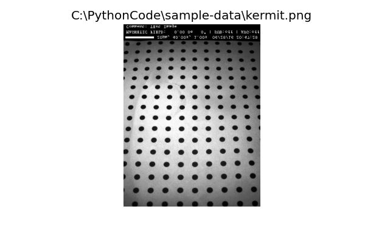

**************************
Working with Images
**************************

.. py:currentmodule:: Stoner.Image

Introduction
============

The :mod:`Stoner.Image` package provides a means to carry out image processing functions in a smilar way that :mod:`Stoner.Core` and :class:`Stoner.Data` and
:class:`Stoner.DataFolder` do.

:class:`ImageFile`
------------------

In the Stoner package, a :class:`ImageFile` represent a single image along with associated metadata from when the image was taken.
The actual image data is stored in the :attr:`ImageFile.image` as a 2D numpy array. This is actually a masked array - the mask is
useful for ignoring certain portions of the image when carrying out operations. As well as the image data, a :class:`ImageFile` also
has a :attr:`ImageFile.metadata` attribute that stores the associated image metadata as a set of key-value pairs in a dictionary.

As with :class:`Stoner.Data`, :class:`ImageFile` has a rich array of methods that can carry out different image analysis tasks -
in common with the philosophy of the Stoner package, these methods operate *in place* and also return the modified :class:`ImageFile`
allowing a sequence of operations to be completed by chaining the method calls together.

The array of methods available to a :class:`ImageFile` is particularly rich as the class automatically wraps functions from the
popular scikit-image package (:py:mod:`skimage`) as well as the :py:mod:`scipy.ndimage` module. In general such functions take an image as their first argument
and :class:`ImageFile` passes its own image data as that argument to whatever function is being wrapped. If the function Returns
image data of the same size that the original image, then the wrapper replaces the :class:`ImageFile`'s image data with the new
image data.

As well as the wrapped scikit-image and scipy.ndimage functions, :class:`ImageFile` provides a set of its own functions for
carrying out some common image processing operations.

By default :class:`ImageFile` can load and save both .tiff and .png files and will embed its metadata into custom tags in those
formats.

Subclasses of the :class:`ImageFile` are provided for reading the .png files produced by the CM group's Evico Kerr Microscopes as well as
a :class:`Stoner.HDF5.STXMImage` class that reads the SLS Pollux Beamline's STXM images.

Loading an Image
----------------

The :class:`ImageFile` constructor supports taking a string argument which is interpreted as a filename of an image format recognised by PIL. The resulting
image data is used to form the contents of the :attr:`ImageFile.image` which holds the image data.::

   from Stoner import ImageFile
   im = Image.ImageFile("kermit.png")

.. image:: ../../sample-data/kermit.png

Like :class:`Stoner.Data` :class:`ImageFile` supports image metadata. Where this can be stored in the file, e.g. in png and tiff images, this is read in
automatically. This metadata is stored as a :class:`Stoner.Core.typeHintedDict` dictionary. This metadata can be set directly in the
construction of the :class:`ImageFile`::

   im = ImageFile(np.arange(10000).reshape(100,100), metadata={'myarray':1})

Examining and manipulating the ImageFile
-----------------------------------------

IF you are using an ipython console or Jupyter Notebook, then the :class:`ImageFile` supports rich format outputs and
it will show you a picture of the image data as its default representation.

ImageFile Attributes and Properties
^^^^^^^^^^^^^^^^^^^^^^^^^^^^^^^^^^^

The key attributes and properties of the :class:`ImageFile` are:

    - :py:attr:`ImageFile.image`:
        This is the actual numpy array of data that is the image.
    - :attr:`ImageFile.metadata`:
        This is the dictionary that contains the metadata associated with the image. This is normally parameters and
        information about the measurement or data that is encoded within the the measurement file, but can be supplemented
        by information added by the user directly or by methods and functions. Each item of metadata is normally referred to by a string *key*.
    - :attr:`ImageFile.filename`:
        This is the name of the file from which the image was loaded (as a string). It is also used as a default title when
        displaying the image.
    - :attr:`ImageFile.mask`:
        This represents the mask data for an image file. By default it is entirely False, meaning all parts of the image
        are visible. It supports a variety of different ways of manipulating which parts of the image are masked - see the section
        below.
    - :attr:`ImageFile.draw`:
        THis is a special attribute that lets you draw simple geometric shapes on the image.

:class:`ImageFile`s use the appropriate data type for the underlying image format - integers for png and either integers or
floating point numbers for tiffs (STXM files are always floating point).

The :meth:`ImageFile.convert` method can be used to convert the data to a more appropriate format::

    im.convert(float)
    im.asfloat()
    im.asint()

It also has simpler :meth:`ImageFile.asfloat` and :meth:`ImageFile.asint` methods for converting to floating point or integer
formats as required.

There are a number of other attributes that can tell you information about the :class:`ImageFile` such as:

    - :attr:`ImageFile.centre`:
        the coordinates of the centre of the image
    - :attr:`ImageFile.aspect`:
        the image aspect ratio
    - :attr:`ImageFile.shape`:
        the size of the underlying numpy array for the image.

To make it easier to quickly get a rotated image, the attributes :attr:`ImageFile.CW` and :attr:`ImageFile.CCW` return
copies of the :class:`ImageFile` that are rotate 90 degrees clockwise and counter-clockwise.

In many cases the default behaviour of modifying the image data in place may not be desired - to get a copy of the
:class:`ImageFile` you use the :attr:`ImageFile.clone` attribute::

    new_im = im.clone.gaussian(4.0) # create a copy of im and then apply a gaussian blur

An :class:`ImageFile` can be indexed like an array to return a new :class:`ImageFile` object which contains only a subset
of the original image data.::

	im[:,10:50] # Return a vertical section of the image

::

	im[::-1,:] # Flip the image vertically

Indexing an :class:`ImageFile` with a string will instead access the metadata stored with the object.::

    im["Loaded as"]
    >>> 'KermitPNGFile'

The :class:`ImageFile` inherits from a dictionary like class - so all the usual Python dictionary methods work on the
metadata of the image.::

    for metadata_key in im:
        print(f"{key}->{im[keuy}")

    averages = im.pop("Averages",1)
    if "Message" in im:
        orint(f"Message = {im['Message']}")

Like the :class:`Stoner.Data` class, the metadata dictionary  will fall back to matching keys with regular expressions
if not exact match is found. In this case, if multiple metadata items match then the result of indexing with a string
may return a dictionary with all the matching keys.

The metadata associated with an image will always be stored in the best Python type that can be found - where possible
metadata is stored in files with a hint as to the native type of that data and this type hint is used to map to an
appropriate Python type. Unmappable types are retained as a string representation.

Common Functions
----------------

It is not possible to provide an exhaustive guid to all the functions made available from scikit-image, scipy.ndimage and
opencv2, but this section will cover some of the commonly used functionality.

Specify a box
^^^^^^^^^^^^^

Many of the functions can be used with a *_box* parameter to limit their operation to a specified region of the image.
Additionally the :meth:`ImageFile.crop` method will discard the image outside a region specified in a similar way. The
working box can be given as follows:

    - A single integer:
        This is interpreted to exclude a region of n pixels from all sides of the image.
    - A single floating point number between 0.0 and 0.5:
        This is interpreted to exclude this corresponding fraction of the width and height from each side of the image
    - A tuple of 4 numbers, or 4 arguments:
        This is interpreeted as a sequence of pxiel coordinates for (left-x, right-x, top-y, bottom-y). If any of the
        numbers are None, then this is take as the minimum or maximum extents of the width or height (depending on whether
        the None value substitutes for the left, right top or bottom coordinate).
    - A single string:
        The argument is interpreted as the name of a metadata item that will define the box to be used.
    - A sigle value False:
        This is equivalent to the whole image (i.e. to not specify a box)
    - A single None value:
        In this case a copy of the image is shown to the user and they are invited to draw the box with the mouse and
        then press the <Enter> key to confirm their selection.

Aligning Two Images
^^^^^^^^^^^^^^^^^^^

The :meth:`Stoner.ImageFile.align` method can ve used to align an image to a reference image. It offers a variety of different
algorithms which may be better or worse depending on the nature of the image. The options are:

    - chi2_shift:
        this uses the image-registration module to carry out a chi-squared analysis of shifting the two images
        relative to each other.
    - imreg_dft:
        this uses the imreg_dft module to carry out the image registration. In essence it takes a fourier transform
        of the two images and then compares the phases within the fourier transforms to calculate the necessary shift.
    - scharr:
        this is the default method used. It first of all applies a Scharr edge detection filter and uses the
        imreg_dft method to find the translation vector.
    - cv2:
        this method uses the opencv2 package's alignment algorithm.

Align also takes a *_box* keyword parameter to confine the section of the image used for the alignment to a specific region
(this can make the operation more efficient  if much of the images are featureless), and a *scale* parameter that will upscale
the image before attempting to do the alignment. This may improve sub-pixel alignment corrections.

As well as returning the shifted images, :meth:`ImageFile.align` will record the translation vector used in the metadata item *tvec*.::

    im.align(ref,method="imreg_dft", scale=4)
    print(f"Translation Vector={im['tvec']}")

Align also calculates a *translation-limits* metadata item that represents the maximum extent of the image where the pixels
have not been added to accommodate the translation for the alignment.

Cropping an Image
^^^^^^^^^^^^^^^^^

The :meth:`ImageFile.crop` will crop the image to the box you specify. If called with no parameters, then it will show the current
image and allow you to draw the crop box on it. Pressing return will select the region to crop.

The combination of the *translation_limits* metadata item from the :meth:`ImageFile.align` method and the specification of the box
for cropping allows images to be aligned and then cropped to match.::

    im.align(ref,method="imreg_dft", scale=4)
    # Crop the image according to the translation limits worked out be align.
    im.crop("translation_limits")

    # Now crop the reference image, using the revsed translation limits
    ref.crop(im.translation_limits("tvec", reverse=True))

Contrast Normalisation
^^^^^^^^^^^^^^^^^^^^^^

If the absolute value of the image data is not important, then normalising the image can improve the contrast. The
:meth:`ImageFile.normalise` will do this.By default it will remap the image intensity values to the range -1 to +1. This
can be changed with the *limits* keyword parameter. The area of the image used to calculate the mapping between the old and
new intensity values can be set with the *sample*  parameter. If there are a few pixels with extreme values in the image then
this can reduce the contrast for the bulk of the image. By using the *limits* parameter you can restrict the portion
of the input range to be rescaled over. For example, *limits=(0.1,0.9)* will map the first 10% and the last 10% of the
pixels to -1 or +1 and the middle 80% between the two extremes.::

    im.normalise(limits=(0.01,0.99))

Image Filtering
^^^^^^^^^^^^^^^

Filtering is frequently used to remove npise and other artefacts from images. Most of the filters that can be applied are
functions within the sckit-image.filters module. A good general purpose option is to use a gaussian filter - this will
convolute the image with a 2-D gaussian function with a user-definable width. This is effective for removing high frequency
noise and speckle.::

    im.gaussian(1.0)

For band-pass filt4ering the scikit-image.filters method *difference_of_gaussians* can be used. This filters the image with two
different gaussian blurs and then takes the difference between them - the smaller gaussian blur removes high frequency noise
whilst the large gaussian removes low spatial frequency variations.::

    im.difference_of_gaussians(1.0,2.0)

Another filtering approach is to us a Savitsky-Golay filter - this fits a polynomial surface locally over the data to smooth
or differentiate the date. This sort of filtering is good for preserving feature sizes in the original data set.::

    im:sgolay2d(pints=5)

Fourier transforms
^^^^^^^^^^^^^^^^^^

Fast Fourier transforms are oftern used when we need to examain the frequency spectra of image data. The :meth:`ImageFile.fft`
method provides a convenient one-stop method for generating the fft that can also take care of some of the artefacts that
can result.::

    fft=im.clone.fft(replace_dc=True, window="hamming")

In this example, a copy of the image is transformed to the mangitude of its fourier transform. THe fourier transform is shifted
so that the central pixels are the 0-ffrequency componennts. The optional keywrod *remove_dc* replaces the 0 frequency data with the
mean value of the FFT to avoid a large spike int he FFT from the mean value of the image. The *window* parameter tells the method
to multiply the image by the corresponding window function (from scikit-image.filters.window) before calculating the FFT. This
avoids artefacts caused by the discontinuities at the edges of the image.

The shifting of the FFT to align the dc componentns to the centre of the image can be controlled with the *shift* keyword
parameter, whilst the output is controlled by the *phase* parameter - False gives the magnitude, True returns the phase angle in radians
and None returns the full complex FFT.

To aid with analyhsing radial distributions in FFTs (or images), the :meth:`ImageFile.radial_profile` method can be used.
This will compute a profile from a given centre outwards - either integrating over all angles, or restricting to specific angles.
At its simpletst one can just do::

    profile=fft.radial_profile()

Which will return a :class:`Stoner.Data` object with columns for the radial distance, mean pixel value at the corresponding radius,
standard deviation and number of pixels counted. The optional *angle* keyword parameter will select either one angle (float) or a
rangle of angles (tuple of two floats). This can be easily plotted since the :class:`Stoner.Data` object is created with the
appropriate columns setup as x oand y data columns.::

    fft.radial_profile(angle=(-0.04,0.04)).plot(plotter=semilogy)

Further functions
^^^^^^^^^^^^^^^^^

Further functions that could be useful:

  - im.threshold_minmax(0.2,0.8)
      Returns a binary image
  - im.plot_histogram()
      Plot a histogram of the pixel intensities
  - im.level_image()
      Flatten a skewed image background
  - im.subtract_image(otherim)
      Subtract another image and enhance contrast
  - im.align(otherim)
      Translate image to line up with other im

Scikit-Image & scipy.ndimage Functions
^^^^^^^^^^^^^^^^^^^^^^^^^^^^^^^^^^^^^^

While many local analysis functions have been added to ImageFile one of the big benefits is that function proxy methods have been added to make the entire
scikit-image library and scipy routines available. Function requests will first search local image functions and secondly look up any function from the external
libraries. The proxy will pass the :attr:`ImageFile.image` attribute as the first argument to any external call to a scikit-image or scipy function. The return value for such
calls is handled a bit carefully:

    #. If the return value is a 2d numpy.ndarray like type that has the same size as the original, or if the *_* keyword argument is set to **True** then the original
        :attr:`ImageFile.image` is replaced with the returned result.
    #. If the return value is anything else then it is simply passed back to the calling program.

In this way, many operations can be carried out 'in-place' on a :class:`ImageFile`. For example::

ImageFile Representation
------------------------

By default, the representation of an ImageFile is just a short textual description, however if the *short_repr& and *short_img_repr* options
are both set to False and a graphical console is in use with an ipython kernel, then th special _repr_png_ method will show a picture of the
contents of the ImageFile instead.::

    i = Stopner.Image.ImageFile("kermit.png")
    i
    >>> kermit.png(<class 'Stoner.Image.core.ImageFile'>) of shape (479, 359) (uint16) and 53 items of metadata
    from Stoner import Options
    Options.short_repr=False
    Options.shoft_img_repr=False
    i
    >>>

.. image:: ../../sample-data/kermit.png

Alternatively the :meth:`ImageArray.imshow` method (accessible to :class:`ImagerFile`) will show the image data in a matplotlib window.

:class:`ImageArray`: A numpy array like class
=============================================

Somewhat analogous to :class:`Stoner.Core.DataArray`, the :class:`ImageArray` is a specialised subclass of :class:`numpy.ma.MaskedArray` used to
store the image data in ImageFile. The numpy.ndarray like data can be accessed at any point via either :attr:`ImageFile.image` or :attr:`ImageFile.data`
and will be accepted by functions that take an numpy.ndarray as an argument.

Working with Lots of Images: :class:`ImageFolder` and :class:`ImageStack`
==========================================================================

Just as :class:`Stoner.DataFolder` allows you to efficiently process lots of separate :class:`Stoner.Data` files, :class:`ImageFolder` does the same for lots
of :class:`ImageFile` files. It is based on the same parent :class:`Stoner.Fodlers.baseFolder` class - so has similar abilities to iterate, form into
sub-folders and so on. In addition, an :class:`Imagefolder` has additional attributes and methods for working with multiple images.

Due to the potentially large amount of data involved in processing images it is good to take advantage of native numpy's speed wherever possible. To this end
:class:`Stoner.Image.ImageStack` is now available. This works very similarly to ImageFolder but internally represents the image stack as a 3d numpy array.
For example::
	imst = ImageStack('pathtomyfolder', pattern='*.tif') #directory is held in memory but images are not loaded yet
	imst = imst['subfolder'] #take advantage of :class:`DiskBasedFolder` grouping abilities
	imst.translate(5,3) #instantiate the stack and translate all images

You can request and manipulate this 3d array directly with the imarray property, alternatively you can ask for any function accepted by the underlying ImageFile
(including the scikit-image and scipy library).

